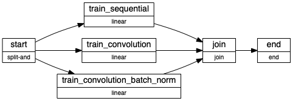

# Experiments With MNIST Using Metaflow

Used Metaflow to test and experiment with different deep learning models for classification of digits on a MNIST dataset

## Setting it Up 

- ``pip install -r requirements.txt``
- Conda is required to Run this. 
    1. Download Miniconda at https://docs.conda.io/en/latest/miniconda.html
    2. ```conda config --add channels conda-forge```

- export PATH="/Users/valaydave/miniconda3/bin:$PATH" --> Change this to where u install miniconda. U need to run this before executing the Experiments. 

## Why Metaflow ?

- Metaflow is this neat library that helps datascientists focus on thier core responsiblities of managing insights extraction by abstracting out computation and data warehousing, versioning and deployments.  

- The below is how a `Flow` is defined on metaflow. Every function marked with the `@step` decorator which helps define a compuational Node in a DAG. Metaflow works on the **dataflow paradigm** so nodes later in the flow can have access to properties set during the pervious steps in the flow. The below flow is an example. see [hello_mnist.py](hello_mnist.py) for actual code. 
- The below flow show cases how 3 different types of models can be trained efficiently in parallel with easy access to results of the entire data pipeline.  

- Please note when run locally each `@step` is a process. But with AWS, one can use `@batch(cpu=3,memory=4000,image=python:3.7)` to run the same step of the flow on a python container in AWS's Batch Service. 
    ```python
    from metaflow import FlowSpec, step
    class MNISTFlowExplain(FlowSpec):
        @step
        def start(self):
            """
            Parse the MNIST Dataset into Flattened and None Flattened Data artifacts. 

            """
            self.data_flattened,self.unflattened =  process_data()

        @step
        def train_sequential(self):
            """
            Train sequential Neural Network with with the Set of parameters. 
            
            """
            self.history = train_sequential(self.data_flattened)
            self.next(self.join)

        @step
        def train_convolution(self):
            """
            Train a Convolutional Neural Network with the Set of parameters.
            """
            self.history = train_convolution(self.unflattened)
            self.next(self.join)

        @step
        def train_convolution_batch_norm(self):
            """
            Train a Convolutional Neural Network with Batch Norm and Dropout with the Set of parameters.
            """
            self.history = train_batch_norm(self.unflattened)
            self.next(self.join)

    
        @step
        def join(self,inputs):
            """
            Join our parallel branches and merge results,
            """
            self.history = {
                'convolution' : inputs.train_convolution.history,
                'sequential' : inputs.train_sequential.history,
                'convolution_batch_norm' : inputs.train_convolution_batch_norm.history
            }
            
            self.next(self.end)

        @step
        def end(self):
            print("Done Computation")

    ```

- The above flow can be presented in the below state diagram. 
- 
- Experiments can be defined with multiple `Parameters` which may be set at runtime. These are stored as a part of every `Run` of the Flow.  
- Once the flow is completed. It can be accessed via 
    ```python
    from metaflow import Metaflow, Flow, get_metadata,Run
    print(Metaflow().flows)
    ```
- See *Experiment Analysis* for more details. 

## Experimentation Strategy :

- Run individual Experiments Using ``python hello_mnist.py --environment=conda run --num_training_examples 10000``

## Metaflow Help 

-  ``python hello_mnist.py --environment=conda run --help`` : This will show all the parameters which are currently avaliable to perform experiments on. 

-  ``python hello_mnist.py --environment=conda show`` : This will show the steps of the DAG used for this Experiment. And each step.

## Experiment Analysis

- After running a couple of Experiments successfully running the [experiments_analytics.ipynb](experiments_analytics.ipynb) will help create charts that will help analyse different parameters of the Experiment. 
